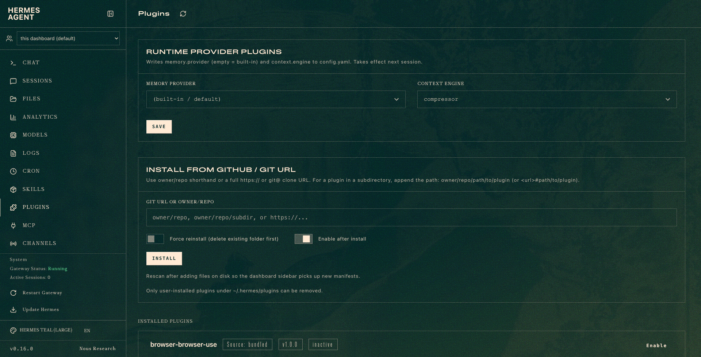
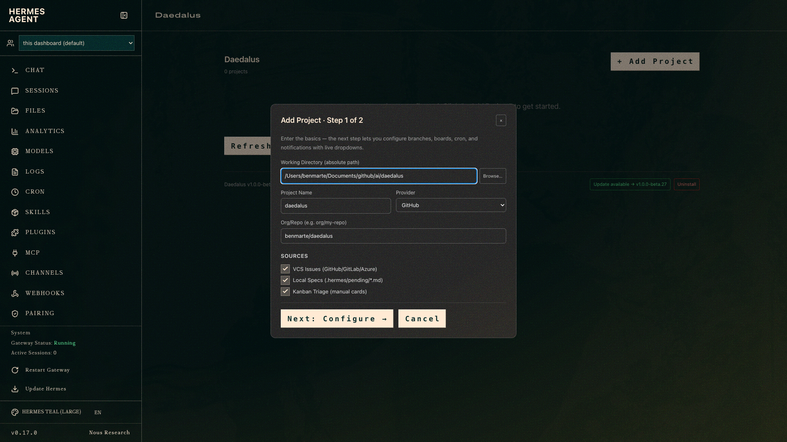

# Daedalus — autonomous issue → PR pipeline on native Hermes

Flag an issue **Ready** — on **GitHub**, **GitLab**, or **Azure DevOps** — and a
roster of AI agents implements it, reviews it, security-audits it, documents it,
and opens a **green, mergeable PR** — with quality gates that *cannot* be skipped,
full board/issue tracking, and zero babysitting. A single Daedalus deployment
drives **many repos**, each with its own provider, kanban board, cron job, and
notification channels (Slack, Discord, Telegram, Signal, WhatsApp, …).

```
issue → "Ready"  (GitHub Project / GitLab board label / Azure work-item state)
      │  (cron tick — deterministic, code)
      ▼
   triage card ──decompose──► developer ─► reviewer ─► security ─► documentation
      │                          │            │           │            │
   board: In progress       opens PR     approves     audits     posts report
                            (lint/format                          to PR + your
                             ship gate)                           chat channels
      ▼
   PR green → you merge → issue auto-closed, card → Done
```


---

## Table of contents

- [Why this exists](#why-this-exists-read-this-part)
- [How it works](#how-it-works)
- [Agent roster](#agent-roster)
- [Self-healing loop](#self-healing-loop)
- [Design decisions](#design-decisions)
- [Multi-repo: one Daedalus, many repos](#multi-repo-one-daedalus-many-repos)
- [Repository layout](#repository-layout)
- [Prerequisites](#prerequisites)
- [VCS providers](#vcs-providers)
  - [Creating the tokens (PAT scopes)](#creating-the-tokens-pat-scopes)
- [Notifications](#notifications)
- [Quickstart](#quickstart)
- [Team setup](#team-setup)
- [Uninstall / reset](#uninstall--reset)
- [Known limitations](#known-limitations)

---

## Why this exists (read this part)

AI coding agents are powerful but, left alone, **chaotic**. On a single issue this
project watched an unmanaged setup produce **nine overlapping PRs**, open PRs that
**failed CI** (lint, typecheck), **skip tests**, lose track of what was done, and
need constant human babysitting. The agents were good at *writing code* — and bad
at *running a process*.

The fix is a hard separation of concerns:

> **Deterministic code decides _what_ happens and _when_. Agents only decide _how_ the code is written.**

Everything that must be reliable — what gets worked, in what order, what quality bar
a PR must clear, how status is tracked, when an issue closes — is **plain code in this
repo**, so it can never be skipped or forgotten. The only agent-driven part is the
actual engineering inside each task. That single boundary is what turns "impressive
demo" into "a tool the team can depend on."

### What that buys you

| Without this | With this |
|---|---|
| One issue spawns 9 PRs | One issue → one tracked card → one PR |
| Agent "forgets" to lint → red PR | **Ship-gate** detects and runs the project's lint/format tools before the PR is opened — no tool mandated |
| A single agent marks its own work done | **Decompose** into developer → reviewer → security → documentation |
| You babysit every handoff | **Auto-advance**: each stage completes on green CI and flows to the next |
| Issues merged to `dev` stay open forever | Dispatcher **closes the issue + moves card to Done** on merge |
| "Works on my machine" | One config, checked in, runs on any teammate's Hermes |

These aren't aspirations — every one was a real failure this pipeline hit and then
closed off in code. The reasoning behind each is in [Design decisions](#design-decisions).

---

## How it works

1. **You** move an issue to **`Ready`** — a GitHub Project column, a GitLab `Ready`
   board label, or an Azure DevOps work-item state. That's the only manual step —
   nothing else moves without it.
2. A **cron tick** runs `daedalus_dispatch.py` (`--no-agent`, pure code). It:
   - selects **only `Ready`** issues (and skips any that already have a PR),
   - flips the board to **In progress**, creates a **triage card**, and **decomposes**
     it across the roster.
3. **Agents** (Hermes kanban workers) execute their tasks:
   - **developer** implements + tests, then must pass the **ship-gate** to open a PR,
   - **reviewer** reviews, **security-analyst** audits, **documentation** writes a
     completion report and posts it to the **PR and your chat channels**.
4. Each tick **auto-advances** any stage that's blocked on review once its PR's CI is
   green — the chain flows hands-off.
5. When you **merge** the PR, the next tick sets the card **Done** and **closes the
   issue** (GitHub doesn't auto-close on a non-default-branch merge, so the dispatcher
   does it).

The kanban board and VCS board status are bookkept **in code on every tick**, so tracking is
deterministic — never dependent on an agent remembering to update anything.

---

## Agent roster

Clicking **Install Agents** provisions 6 specialist Hermes profiles. Each is a
separate agent with its own context, credentials, and curated skill set — no
profile can see another's in-progress work. The separation enforces the
"no grading your own homework" principle: every handoff is a different agent with
a different perspective.

| Profile | Role | Writes code? |
|---|---|---|
| `project-manager-daedalus` | Scope, acceptance criteria, decomposition, pre-ship checklist. Coordinates the team. | No |
| `planner-daedalus` | Task graph, interface contracts, architecture decisions. | No |
| `developer-daedalus` | Implementation, tests, ship-gate, PR open. | Yes |
| `reviewer-daedalus` | Code review — correctness, quality, performance. Approves or blocks with actionable findings. | No |
| `security-analyst-daedalus` | Security audit — OWASP, injection, secrets, authn/z. Blocks on risk with severity-rated findings. | No |
| `documentation-daedalus` | READMEs, ADRs, changelogs, completion report posted to the PR and chat channels. | No |

### Skills per profile

Each profile installs only the [agent-skills](https://github.com/addyosmani/agent-skills)
workflows relevant to its phase. Skills are curated process templates — an agent
follows the skill's checklist rather than winging the approach, which is what
makes the pipeline repeatable rather than demo-quality.

**`project-manager-daedalus`**

| Skill | What it governs |
|---|---|
| `idea-refine` | Structured divergent → convergent thinking; turns vague requests into buildable scopes |
| `spec-driven-development` | Requirements and acceptance criteria before any code exists |
| `planning-and-task-breakdown` | Decomposes a spec into ordered, verifiable work chunks |
| `shipping-and-launch` | Pre-launch checklist: risk review, rollback plan, monitoring |
| `using-agent-skills` | Meta-skill: skill discovery and invocation rules |

**`planner-daedalus`**

| Skill | What it governs |
|---|---|
| `spec-driven-development` | Requirements and acceptance criteria |
| `planning-and-task-breakdown` | Task graph with stable inter-task interface contracts |
| `context-engineering` | Loads the right context at the right time; avoids token waste |
| `source-driven-development` | Verifies assumptions against official docs before committing to an approach |
| `api-and-interface-design` | Stable interface definitions with clear contracts and evolution rules |
| `using-agent-skills` | Meta-skill |

**`developer-daedalus`**

| Skill | What it governs |
|---|---|
| `context-engineering` | Scoped context loading |
| `source-driven-development` | Docs-first verification before implementing |
| `incremental-implementation` | Thin vertical slices: implement → test → verify, one slice at a time |
| `test-driven-development` | Failing test first, then make it pass |
| `frontend-ui-engineering` | Production-quality UI with accessibility |
| `api-and-interface-design` | Interface-stable implementation |
| `debugging-and-error-recovery` | Reproduce → localize → fix → guard |
| `git-workflow-and-versioning` | Atomic commits, clean branch history |
| `using-agent-skills` | Meta-skill |

**`reviewer-daedalus`**

| Skill | What it governs |
|---|---|
| `code-review-and-quality` | Five-axis review: correctness, readability, architecture, security, performance |
| `code-simplification` | Identifies complexity that can be reduced without behavior change |
| `performance-optimization` | Measure first; optimize only what evidence shows matters |
| `test-driven-development` | Verifies test coverage is adequate |
| `debugging-and-error-recovery` | Traces potential failure paths in the diff |
| `git-workflow-and-versioning` | Reviews commit history quality |
| `using-agent-skills` | Meta-skill |

**`security-analyst-daedalus`**

| Skill | What it governs |
|---|---|
| `security-and-hardening` | OWASP prevention, input validation, least-privilege, secrets audit, injection/SSRF |
| `code-review-and-quality` | Quality gate alongside the security findings |
| `source-driven-development` | Verifies security claims against authoritative references |
| `debugging-and-error-recovery` | Traces exploit paths and edge-case failure modes |
| `using-agent-skills` | Meta-skill |

**`documentation-daedalus`**

| Skill | What it governs |
|---|---|
| `documentation-and-adrs` | READMEs, Architecture Decision Records, changelogs |
| `source-driven-development` | Verifies documentation accuracy against the actual code |
| `context-engineering` | Loads only the relevant merged changes into context |
| `using-agent-skills` | Meta-skill |

---

## Self-healing loop

`core/iterate.py` runs on every cron tick after the main dispatch. It scans every
blocked card and routes it to the agent that can clear it — the pipeline never
stalls waiting for a human unless it has already retried 3 times.

```
blocked card detected
        │
        ├─ developer card + CI green + review-required?
        │       └──► advance
        │             complete the developer card
        │             chain flows automatically to reviewer + security-analyst
        │
        ├─ developer card + CI red?
        │       └──► dev_fix_ci
        │             create an idempotent fix card assigned to developer-daedalus
        │             key: fix-ci-{card_id}-attempt-{N}
        │             only fires when CI is definitively RED (not UNKNOWN/PENDING)
        │
        ├─ reviewer or security-analyst card + changes requested?
        │       └──► pm_route
        │             create a PM routing card assigned to project-manager-daedalus
        │             PM reads the findings and decides the fix owner:
        │               developer-daedalus, security-analyst-daedalus, or re-spec
        │             the reviewer/security card is marked "awaiting-fix"
        │
        ├─ reviewer or security-analyst card + approved?
        │       └──► approve_advance
        │             complete the card; next stage starts
        │
        └─ any action, attempt count > 3?
                └──► escalate
                      post a comment to the card
                      leave it blocked for a human
                      no new fix cards are ever created beyond this cap
```

**Idempotency.** Fix cards are keyed `fix-ci-{card_id}-attempt-N` and
`pm-route-{card_id}-attempt-N`. Before creating one, the loop cross-checks the
live board for a card with that key — multiple dispatcher instances (or a restart
mid-tick) never double-create fix cards. Attempt counts survive across ticks in
`.hermes/daedalus-fix-attempts.json`.

**Awaiting-fix unblock.** When a developer fix card completes, the loop
automatically unblocks any reviewer or security-analyst cards that were marked
"awaiting-fix" for that issue. They re-enter the queue without human intervention.

**Escalation cap.** `MAX_FIX_ATTEMPTS = 3`. After three attempts the loop posts a
comment, leaves the card blocked, and stops. The pipeline never runs away — every
blocked card has a finite ceiling and exactly one deterministic path forward.

---

## Design decisions

Each piece exists because the obvious approach failed:

- **Ready-gating** — the dispatcher works *only* issues you put in `Ready`. You stay in
  control of what the fleet touches; it never surprises you by grabbing the backlog.
- **Ship-gate** — before pushing, the developer agent detects the project's configured
  lint and format tools and runs them: `.pre-commit-config.yaml` → `pre-commit run --all-files`;
  `package.json` lint/format scripts → `npm run lint && npm run format`;
  `pyproject.toml` ruff config → `ruff check --fix && ruff format`;
  `Makefile` lint target → `make lint`. Skips gracefully when nothing is configured.
  Auto-fixes are committed before the PR is opened. A "remember to run linting" note
  in agent memory was skipped repeatedly; a gate in the task instructions cannot be.
- **Triage + decompose** — real separation of concerns across specialist agents
  (developer / reviewer / security-analyst / documentation), not one agent grading its
  own homework.
- **Auto-advance** — workers *block for review* instead of completing, which stalls the
  chain. The dispatcher completes a review-required handoff once its PR's CI is green,
  so the pipeline is genuinely hands-off (the PR still waits for a human merge).
- **Self-healing loop** (`core/iterate.py`) — every blocked card is classified into one
  of 5 actions and routed to the agent that can clear it:
    - `advance` — dev PR green + review-required → complete dev card, chain flows to reviewer/security
    - `dev_fix_ci` — CI red → creates idempotent developer fix card
    - `pm_route` — reviewer/security requests changes → creates PM routing card with findings; PM decides owner (developer, security-analyst, re-spec), then fix lands. Reviewer cards are marked "awaiting-fix" and auto-unblocked when the fix completes.
    - `approve_advance` — reviewer/security approved → complete the card
    - `escalate` — cap at 3 fix attempts per PR → log + notify, set card aside (no infinite loop)
  Fix cards are idempotent per `(card, attempt)`. When a dev fix completes, awaiting
  reviewer/security cards are automatically unblocked for re-review. The loop never
  stalls — every blocked card has a deterministic path forward.
- **merged → Done + close** — a PR merged into `dev` doesn't auto-close its issue
  (GitHub only does that on the default branch), so the dispatcher closes it itself —
  and only after confirming no sibling PR is still open.

---

## Multi-repo: one daedalus, many repos

There is **one** daedalus and **one** agent roster. Every repo you want it to drive
carries its own checked-in `<repo>/.hermes/daedalus.yaml` (scaffolded by the
dashboard's **+ Add Project** or `scripts/setup.sh`) and is listed in the
registry at `~/.hermes/daedalus/projects`. Each project picks its own provider,
board, base branch, schedule, and channels:

```yaml
# app-one/.hermes/daedalus.yaml
name: app-one
repo: ORG/app-one
workdir: /path/to/app-one
vcs: { provider: github, target_branch: dev }
tracking: { github_project_number: 1 }
cron:
  schedule: "every 60m"
  notifications:
    - { platform: Slack, target: "slack:C0CHANNEL1", events: [doc-report, pipeline-failure] }

# api-two/.hermes/daedalus.yaml
name: api-two
repo: group/api-two
vcs: { provider: gitlab, target_branch: main }
tracking: { label_board: true }
cron: { schedule: "every 2h", deliver: "discord:#api-two" }
```

Each repo gets its **own kanban board**, its **own cron job** (edits update it in
place), and its **own ship-gate policy** (keyed by the repo's origin remote).
Onboarding a repo = one dashboard click (or `setup.sh`) + a `Ready` column/label
on its board.

---

## Repository layout

| Path | What it is |
|------|------------|
| `scripts/daedalus_dispatch.py` | The deterministic dispatch tick (cron entrypoint, `--no-agent`). Ready-gating, reconcile, decompose, auto-advance, merged→close. |
| `core/iterate.py` | Self-healing loop: classify blocked cards into 5 actions, idempotent fix-card creation, iteration cap + escalation, reviewer re-engage after fix. |
| `scripts/provision_roster.sh` | Provisions the 6-agent Hermes roster. |
| `core/providers/` | VCS provider layer: GitHub (REST + GraphQL Projects v2), GitLab (REST), Azure DevOps (REST/WIQL) — token-authenticated HTTPS APIs, extensible via `register_provider()`. |
| `core/kanban.py` | Thin, idempotent wrapper over `hermes kanban` (triage, decompose, complete). |
| `config/` | `ConfigLoader` (defaults + per-repo merge), `validate_vcs`, and the config template. |
| `dashboard/` | Dashboard tab: project grid, add/edit project modals, notifications editor (`plugin_api.py` + React `src/App.jsx`). |
| `tests/` | Unit tests — config, providers (mocked HTTP), dispatcher, dashboard API, installers. |

The **ship-gate hook**, **cron wrapper**, and **roster profiles** live in the Hermes
home (`$HERMES_HOME`), not here — see [`SETUP.md`](SETUP.md) for how they're deployed
and shared across a team.

---

## Prerequisites

| Requirement | Why |
|---|---|
| [Hermes](https://herm.es) installed + model auth | The runtime everything runs on |
| `bun` | Dashboard build (only needed if you modify `dashboard/src/`) |

**Everything else is automatic.** Clicking **Install Agents** in the dashboard (or running `postinstall.py`) auto-installs [agent-skills](https://github.com/addyosmani/agent-skills) if it is missing. `pyyaml` ships inside the Hermes venv. The developer agent auto-detects the project's lint/format tooling at ship time — no specific tool is required up front.

**No VCS CLIs needed — ever.** Everything (dispatcher, dashboard, AND worker
agents) talks to your VCS host via its **HTTPS API** with a token from the
environment. Worker `git push` authenticates through a per-profile credential
store written by the roster provisioner; PRs and comments go through the
provider API with the token already in each worker's env.

## VCS providers

The provider is **auto-detected from the repo's `origin` remote** (github.com,
gitlab hosts — incl. self-hosted `base_url`, dev.azure.com / *.visualstudio.com
— incl. org/project/repo) by both `setup.sh` and the dashboard's Add Project
(leave the provider on "Auto-detect" and the repo field empty). You can always
pin it manually in `.hermes/daedalus.yaml` (`vcs.provider`) or the dropdown. Tokens are read **only from environment
variables** — never from config files — and are redacted from all errors/logs.
Override the env var name per project with `vcs.token_env`.

**Where to put the tokens:** add them to **`~/.hermes/.env`**
(e.g. `GITHUB_TOKEN=ghp_...`) — Hermes loads that file at startup, which covers
the dispatcher cron and the dashboard (restart the gateway + dashboard after
editing). Also export them in your shell before running
`scripts/provision_roster.sh` so each worker profile gets them seeded into its
own `.env` / `.git-credentials` / `terminal.env_passthrough`.

| Provider | `vcs.provider` | Token env (default) | Minimal token scopes | Board model |
|---|---|---|---|---|
| GitHub | `github` | `GITHUB_TOKEN` / `GH_TOKEN` | see [Creating the tokens](#creating-the-tokens-pat-scopes) | Projects v2 (`tracking.github_project_number`) |
| GitLab | `gitlab` | `GITLAB_TOKEN` | `api` + `write_repository` | Issue-Board labels (`tracking.label_board: true`; lists keyed to `vcs.status_map` labels). Self-hosted via `vcs.base_url` |
| Azure DevOps | `azuredevops` | `AZURE_DEVOPS_PAT` | Work Items R&W, Code R&W, Build Read | Work-item states (`vcs.org` + `vcs.project` + `vcs.repo`; `vcs.work_item_type`, default `Issue`) |

### Creating the tokens (PAT scopes)

One token per provider covers everything daedalus does with it: dispatcher
polling + board moves, dashboard pickers, worker `git push` (via the
per-profile credential store), and PR create/comment API calls.

**GitHub — fine-grained PAT** (github.com → Settings → Developer settings →
Fine-grained tokens). Grant access to the repos daedalus drives, with:

| Permission | Level | Used for |
|---|---|---|
| Contents | **Read and write** | workers push branches |
| Pull requests | **Read and write** | open PRs, post the doc report |
| Issues | **Read and write** | poll Ready issues, close on merge |
| Commit statuses + Checks | Read | CI-green gating |
| Metadata | Read | (mandatory baseline) |
| Projects *(organization permission)* | **Read and write** | Projects v2 board sync |

> Org-owned Projects v2 boards require your org to allow fine-grained PATs.
> If that's not enabled, use a **classic PAT** with `repo` + `project` scopes
> (+ `workflow` only if agents will edit `.github/workflows/`).

**GitLab — personal access token** (GitLab → Preferences → Access tokens):
`api` (covers issues, boards/labels, MRs, notes, pipelines) and
`write_repository` (workers push over HTTPS). Same scopes on self-hosted.

**Azure DevOps — PAT** (dev.azure.com → User settings → Personal access
tokens), scoped to your organization:
- **Work Items: Read & Write** — poll/close/move work items
- **Code: Read & Write** — list PRs/branches, create PRs + threads, worker pushes
- **Build: Read** — CI status on PRs

**Security tips:** prefer a dedicated bot/machine account so PRs and comments
are attributed to it (pass its token as `ROSTER_GH_TOKEN` when provisioning);
set an expiry and rotate; if you want the dispatcher even more locked down,
give it its own read-mostly token via `vcs.token_env` and keep the write
token only in the worker profiles.

The canonical pipeline statuses (`ready` / `in_progress` / `in_review` / `done`)
map to your board's column/label/state names via `vcs.status_map` — defaults are
`Ready` / `In progress` / `In review` / `Done`.

Other trackers (Jira, Linear, Gitea, Bitbucket, …) plug in by implementing the
`core/providers/base.py` interface and calling `register_provider()` — the
dispatcher and dashboard never need to change.

## Notifications

Reports and tick summaries go to **any configured Hermes messaging platform**
via `hermes send` — Slack, Discord, Telegram, Signal, WhatsApp, SMS, etc. Two
modes per project:

- **Single target** (`cron.deliver: "slack:C123"`) — the cron delivers the
  dispatcher's summary; doc reports go to the same target.
- **Multi-target** (`cron.notifications`) — a list of `{platform, target,
  events}` entries; each channel picks which events it receives
  (`doc-report`, `dispatch-summary`, `pipeline-failure`, `pr-ready`; omit
  `events` to receive everything). Configure it in the dashboard's
  **Notifications** editor — channels are discovered from `hermes send --list`,
  with manual entry as fallback.

## Troubleshooting

**macOS "Keychain Not Found" prompt during install?** It's a benign interaction
between git's `osxkeychain` credential helper and a public-repo clone — no
credentials are needed and nothing is exposed. Click **Cancel** (NOT "Reset To
Defaults", which resets your login keychain). To suppress it, either unlock your
login keychain or set a non-keychain helper:
`git config --global credential.helper ""`.

## Quickstart

**1. Install the plugin:**
```bash
hermes plugins install benmarte/daedalus --enable
hermes gateway restart            # load the plugin
```



> **macOS note:** on macOS without launchd management, `hermes gateway restart` falls
> back to running the gateway as a **background process**. It works, but does NOT
> auto-start at login or auto-restart on crash.

**2. Provision the agent roster** — open `hermes dashboard` → **Daedalus** tab →
click **Install Agents**. This auto-installs agent-skills if missing and creates the
6 specialist profiles (takes ~10–20 s). Or from the terminal:
```bash
python3 ~/.hermes/plugins/daedalus/scripts/postinstall.py
hermes profile list               # expect: developer reviewer security-analyst documentation planner project-manager
```


**3. Onboard a target repo** — either click **”+ Add Project”** in the dashboard
(scaffolds the config, registers the repo, creates its kanban board + cron), or
from the terminal:
```bash
cd /path/to/your/repo
bash ~/.hermes/plugins/daedalus/scripts/setup.sh
# then edit .hermes/daedalus.yaml (vcs provider, tracking, sources, cron) — repo/workdir are fixed
```



Prefer hand-writing the config? That works too: copy
[`templates/daedalus.yaml`](templates/daedalus.yaml) to `<repo>/.hermes/daedalus.yaml`,
edit it, then run `setup.sh` once to register the repo (it never overwrites an
existing config without `--force`) — or skip the registry entirely and run a
single repo with `daedalus_dispatch.py --repo /path/to/repo`.

Export the provider token for the dispatcher's environment (see
[VCS providers](#vcs-providers)), e.g. `GITHUB_TOKEN`, `GITLAB_TOKEN`, or
`AZURE_DEVOPS_PAT`.

**4. Trigger work** — all three sources are **enabled by default** (toggle any
off in the config):
- **Prompt / spec file:** `hermes kanban create --triage --workspace dir:$PWD --body "$(cat spec.md)"`
- **Spec drop:** put a `*.md` in `<repo>/.hermes/pending/` (when `sources.local_specs.enabled`)
- **VCS issue:** move an issue/work item to **Ready** — GitHub Project column,
  GitLab `Ready` board label, or Azure DevOps work-item state

The triage card decomposes across the roster → developer opens a PR → reviewer + security
gate it → CI-aware auto-advance → documentation posts the resolution **on the PR** and your
configured chat channels. You merge (agents never merge `main`).

**5. Visual config + status** — `hermes dashboard` → the **Daedalus** tab: a card per
project with live status (kanban counts, open PRs + CI, needs-attention, cron), and an
editor for each project's config (`repo`/`workdir` are read-only).


**6. Automate** — schedule the dispatcher so advancing/onboarding run unattended:
```bash
hermes cron add daedalus --schedule "every 3m" \
  --script "python3 ~/.hermes/plugins/daedalus/scripts/daedalus_dispatch.py"
```

---

## Team setup

See **[`SETUP.md`](SETUP.md)** for everything beyond the single-machine quickstart:

- **Sharing across teammates** — the repo is secret-free; each person runs `provision_roster.sh` locally with their own LLM keys and VCS tokens. No shared profile exports (those bundle credentials).
- **Per-project conventions** — custom `status_map` column names, branch prefixes, bot identity (`ROSTER_GH_TOKEN` / `ROSTER_BOT_NAME`), and how to pin a dedicated read-mostly dispatcher token.
- **Multi-user cron** — running the dispatcher on a shared server so the pipeline advances without anyone's laptop being open.
- **Full installation guide** — step-by-step with screenshots: [`docs/INSTALLATION_GUIDE.md`](docs/INSTALLATION_GUIDE.md).

---

## Uninstall / reset

**Option A — dashboard button (easiest):** open `hermes dashboard` → Daedalus tab →
scroll to the footer → click **Uninstall Daedalus**. It removes profiles, cron jobs,
kanban boards, config, and the plugin package in one go, with a confirmation dialog
before anything is deleted.

**Option B — terminal:**
```bash
# HERMES_HOME defaults to ~/.hermes — set it if yours is elsewhere
bash "$HERMES_HOME/plugins/daedalus/scripts/uninstall.sh"
```

This single command removes profiles, cron jobs, kanban boards, config, AND the
plugin package in one go. It shows a data-loss summary first so you can review
what will be removed before confirming (or use `-y` for scripting).

> **Do NOT use `hermes plugins uninstall daedalus` alone** — that only deletes
> the plugin directory and leaves profiles, cron jobs, boards, config, and
> hook artifacts behind. Hermes has no uninstall hook for plugins to clean up
> after themselves. Use the dashboard button or `uninstall.sh` for a complete uninstall.

```bash
# Skip the plugin removal (keep daedalus installed, reset host state only):
bash "$HERMES_HOME/plugins/daedalus/scripts/uninstall.sh" --keep-plugin

# Keep the 6 agent profiles:
bash "$HERMES_HOME/plugins/daedalus/scripts/uninstall.sh" --keep-profiles

# Both — keep profiles AND the plugin, reset everything else:
bash "$HERMES_HOME/plugins/daedalus/scripts/uninstall.sh" --keep-profiles --keep-plugin

# Non-interactive (scripting / CI):
bash "$HERMES_HOME/plugins/daedalus/scripts/uninstall.sh" -y
```

The uninstall script is idempotent — safe to re-run; absent items are skipped
without error.

---

## Known limitations

- **Restart the dashboard server after install/update.** The Hermes dashboard loads
  each plugin's `plugin_api.py` once at startup and does NOT hot-reload. After
  `hermes plugins install/update daedalus`, you must restart the dashboard server
  **and** reload the browser tab for backend changes (e.g. saving/creating a cron job)
  to take effect. Restarting the gateway alone is not enough.

- **Uninstall with `scripts/uninstall.sh`, not `hermes plugins uninstall` alone.**
  Core Hermes has no plugin-uninstall hook — `hermes plugins uninstall daedalus` only
  deletes the plugin folder and leaves roster profiles, cron jobs, kanban boards, and
  config behind. Use [`scripts/uninstall.sh`](scripts/uninstall.sh) for a complete
  uninstall (see [Uninstall / reset](#uninstall--reset)).

- **macOS gateway: no launchd in some setups.** `hermes gateway restart` can't use
  launchd on some macOS versions and falls back to a background process. It works, but
  won't auto-restart on crash or auto-start at login.

- **Agents can't message chat platforms directly.** Notifications and reports are
  delivered by the deterministic dispatcher (root cron context), not by individual
  agents. Set channels via the config modal's Notify Via dropdown or the multi-target
  Notifications editor, and use the **Send test message** button to verify connectivity.

- **GitLab/Azure worker flows are less battle-tested than GitHub.** The dispatcher
  and dashboard are fully provider-backed (mocked-API test suites for all three),
  but worker agents pushing branches/opening MRs on GitLab/Azure need their own
  credentials in the profile environment (`GITLAB_TOKEN` / `AZURE_DEVOPS_PAT`) and
  have not been dogfooded end-to-end yet — beta feedback welcome.

- **Single-machine validation.** This beta has been dogfooded on one machine.
  Cross-machine and multi-user behavior is exactly what beta feedback should surface —
  please report anything unexpected.
