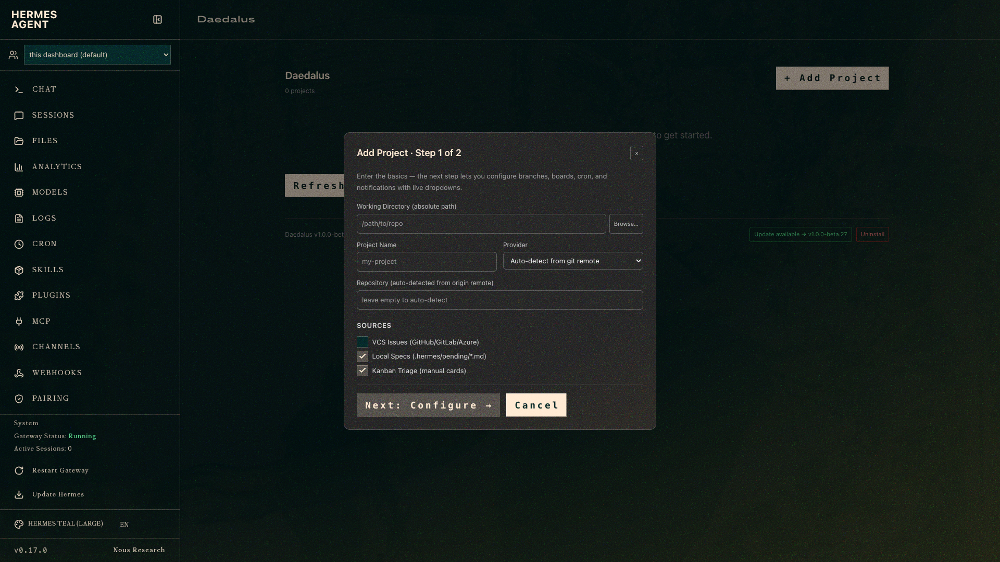
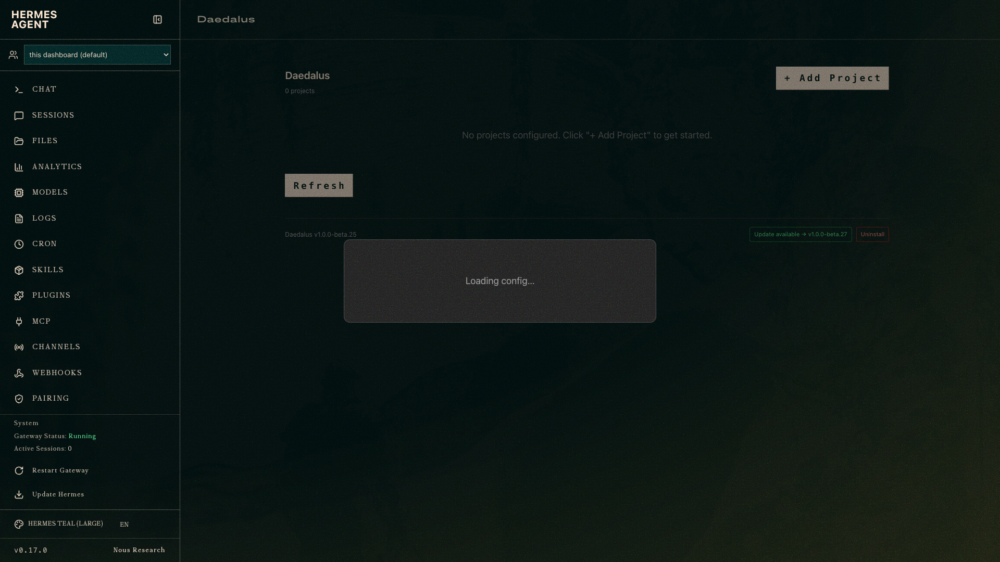
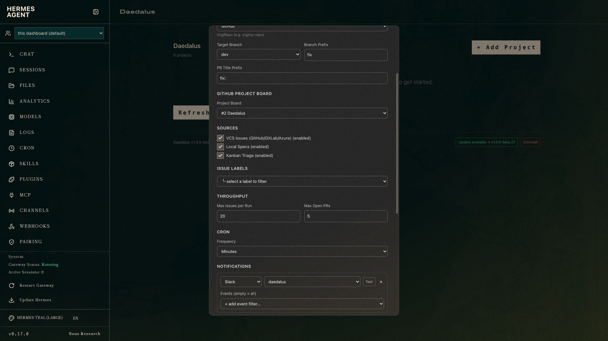
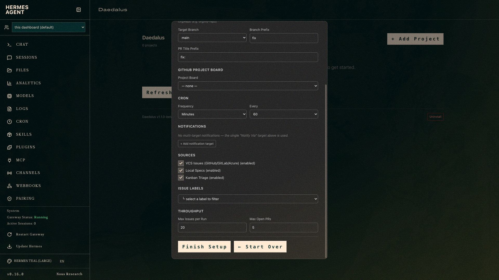
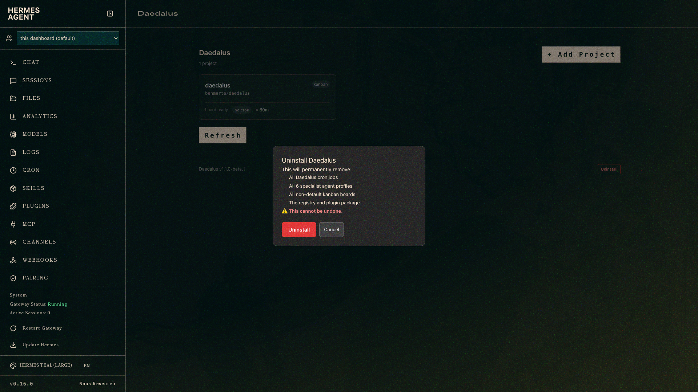

# Daedalus — Installation & Usage Guide

**Daedalus** is a [Hermes](https://herm.es) plugin that automates the journey from a GitHub, GitLab, or Azure DevOps issue all the way to a reviewed, mergeable pull request. You mark an issue **Ready**, and a team of nine AI agents validates it, implements it, runs QA, reviews it, security-audits it, WCAG-audits it (for UI work), and documents it. When the PR is merged, Daedalus closes the issue and moves the board card to **Done**.

This guide walks you through every step: installing the plugin, provisioning the agents, adding your first project, and keeping everything up to date.

---

## Table of Contents

1. [Prerequisites](#1-prerequisites)
2. [Install the Plugin](#2-install-the-plugin)
3. [Provision the Agent Roster](#3-provision-the-agent-roster)
4. [Add Your First Project — Step 1](#4-add-your-first-project--step-1)
5. [Configure the Project — Step 2](#5-configure-the-project--step-2)
6. [Dashboard Overview](#6-dashboard-overview)
7. [How the Kanban Board Works](#7-how-the-kanban-board-works)
8. [How the Cron Job Works](#8-how-the-cron-job-works)
9. [Customizing Agents](#9-customizing-agents)
10. [Autonomous Pipeline Advancement](#10-autonomous-pipeline-advancement)
11. [Add Your VCS Token](#11-add-your-vcs-token)
12. [Triggering Work](#12-triggering-work)
13. [Update the Plugin](#13-update-the-plugin)
14. [Remove a Project](#14-remove-a-project)
15. [Uninstall Daedalus](#15-uninstall-daedalus)
16. [Troubleshooting](#16-troubleshooting)
17. [What's Next](#17-whats-next)

---

## 1. Prerequisites

| Requirement | Why it's needed |
|---|---|
| [Hermes](https://herm.es) installed with a working default profile | The runtime that runs agents and the dashboard |
| A VCS API token for the platform you use | Lets Daedalus poll issues and open PRs on your behalf |

> **Everything else is automatic.** When you click **Install Agents**, Daedalus installs the [agent-skills](https://github.com/addyosmani/agent-skills) plugin automatically if it is missing. No manual setup required.

> **No `gh`, `glab`, or `az` CLI needed.** Daedalus talks directly to your VCS platform's HTTPS API. No additional CLIs required.

---

## 2. Install the Plugin

```bash
hermes plugins install benmarte/daedalus --enable
hermes gateway restart
```

The `gateway restart` is required so Hermes registers Daedalus's API routes and dashboard tab.


You should now see **Daedalus** listed as enabled on the Plugins page.

> **macOS note:** On macOS without launchd management, `hermes gateway restart` falls back to a background process. Everything works, but the gateway won't auto-start at login or restart itself if it crashes. This is a Hermes limitation.

---

## 3. Provision the Agent Roster

Open the Hermes dashboard and go to the **Daedalus** tab. On a fresh install, you'll see a **Worker Agents not provisioned** banner:


Click **Install Agents**. Daedalus runs its provisioner and creates nine specialist profiles. This takes about 10–20 seconds.

Verify the profiles by going to **Profiles** in Hermes:


### The Nine Agent Roles

| Role | What it does |
|---|---|
| **validator** | **Runs alone in Phase 1.** No developer, reviewer, or other agent starts until this completes. Confirms the issue is real, reproducible, not already fixed. Detects security threats (prompt injection, social engineering, auth bypass, backdoor patterns, supply-chain attacks) and high-privilege requests lacking verifiable context. Six outcomes: **CONFIRMED** (Phase 2 begins on next tick), **ALREADY_FIXED** (closes issue), **DUPLICATE** (closes issue), **NEEDS_MORE_INFO** (blocks, comments asking reporter), **SECURITY_THREAT** (blocks, posts issue comment, fires `security-escalation` notification), **BLOCK_FOR_REVIEW** (high-privilege action without identity/justification/approval — blocks, posts comment listing exactly what's missing, fires `security-escalation`). Posts a summary comment to the GitHub issue regardless of outcome. Blocking outcomes auto-move the VCS card to a **Blocked** column (created automatically if missing). |
| **project-manager** | Coordinates work, routes issues to agents, unblocks stalled pipelines. Creates the conditional accessibility task when the issue references UI/frontend work. |
| **planner** | Breaks an issue into a concrete plan with acceptance criteria. |
| **developer** | Phase 2 only. Writes code, runs tests, auto-detects and runs the project's lint/format tools before opening a PR. Posts a summary comment to the GitHub issue on completion. |
| **qa** | **Runs after developer, before reviewer and security-analyst.** Runs the full test suite, analyzes coverage gaps, reports a QA verdict (`qa-passed` or `qa-failed`). Posts a summary comment to the GitHub issue. |
| **reviewer** | Reviews the PR for correctness, style, and logic. Runs after QA passes. Posts a summary comment to the GitHub issue on completion. |
| **security-analyst** | Audits for secrets, injection risks, and over-permissioned code. Runs after QA passes, in parallel with reviewer. Posts a summary comment to the GitHub issue on completion. |
| **accessibility** | **Runs after QA passes, in parallel with reviewer/security-analyst. Conditional — only created when the issue references UI/frontend work.** Audits the PR against WCAG 2.1 AA and posts a findings table. Blocks with `approved` or `changes requested`. |
| **documentation** | Writes a completion report, posts it on the PR, and sends it to notification channels. Waits for reviewer, security-analyst, and accessibility (when assigned) to clear. Posts a summary comment to the GitHub issue on completion. |

> **Why separate roles?** An agent reviewing its own work is the same as no review. Hard role separation ensures each stage is independently verified. The validator prevents the entire pipeline from running on issues that aren't real work — and the enforcement is structural: downstream tasks don't exist until the validator says CONFIRMED.

After provisioning, the Daedalus tab shows a clean empty dashboard ready for your first project:


---

## 4. Add Your First Project — Step 1

Click **+ Add Project** in the top right corner. Adding a project is a two-step process. Step 1 collects the basics.



### Enter the repository path

Type (or paste) the full absolute path to the repository you want Daedalus to manage, then click outside the field or press Tab. Daedalus reads the repository's `origin` remote and **auto-detects**:

- The **VCS provider** (GitHub, GitLab, or Azure DevOps)
- The **repo slug** (e.g. `myorg/my-app`)
- A default **project name**

You can also click **Browse…** to pick a directory from a native folder picker.


### Source toggles

The **Sources** section controls what triggers Daedalus to pick up work:

| Source | What it does |
|---|---|
| **VCS Issues** | Polls your GitHub/GitLab/Azure board for issues in the Ready state |
| **Local Specs** | Watches `.hermes/pending/*.md` for spec files to implement |
| **Kanban Triage** | Picks up manual triage cards created directly on the Hermes kanban board |

All three are enabled by default. Click **Next: Configure →** to create the project and move to Step 2.

---

## 5. Configure the Project — Step 2

Step 2 opens automatically after Step 1. This is where you set branches, boards, cron schedule, and notifications:



### Fields at a glance

**VCS section:**
- **Provider** — auto-detected; change if needed
- **Target Branch** — the branch PRs are opened against (default: `main`)
- **Branch Prefix** — prefix added to branches created by the developer agent (default: `fix/`)
- **PR Title Prefix** — prefix added to PR titles (default: `fix:`)

**GitHub / GitLab / Azure Board:**
- Link to a Projects v2 board number (GitHub), GitLab label board, or Azure DevOps board. Daedalus syncs card status to/from your VCS board.

**Cron section:**
- How often the dispatch loop runs (default: every 60 minutes). Pick minutes, hours, or enter a raw cron expression.



**Notifications:**
- Configure one or more delivery targets (Slack, Discord, etc.) for dispatch summaries, documentation reports, and pipeline failure alerts.
- Click **+ Add notification target** to add a channel. Each target can be filtered to specific event types (`doc-report`, `dispatch-summary`, `pipeline-failure`, `pr-ready`, `security-escalation`).
- **`security-escalation`** fires immediately when the validator flags an issue as a potential threat. It is recommended to route this event to a high-visibility channel (e.g. `#security-alerts`) so a human can review and re-classify the issue quickly.



Click **Finish Setup** to save. Daedalus will:
1. Write a config file at `<your-repo>/.hermes/daedalus.yaml`
2. Create a dedicated **kanban board** for this repo
3. Create a **cron job** that polls on your chosen schedule

---

## 6. Dashboard Overview

After adding a project, the Daedalus tab shows a card for each project:


Each card shows:

- **Project name and repo** slug
- **Cron** — the schedule and last-run time
- **Kanban summary** — counts of cards by status once the dispatcher starts running
- **Open PRs** — how many PRs are currently open with their CI status
- **Needs attention** — any cards that are blocked or gave up (needs human input)

Click the **gear icon** on any card to open its config modal, where you can change branches, boards, cron schedule, and notifications.

---

## 7. How the Kanban Board Works

Every Daedalus project gets its own **kanban board** inside Hermes. Cards move through columns as the agents work:

1. An issue is moved to **Ready** on your VCS board.
2. The next cron tick creates **one validator task** (Phase 1). No developer, reviewer, or other
   downstream task exists yet — this is a hard infrastructure enforcement, not an instruction.
3. The **validator** confirms the issue is real, checks for security threats, and completes with
   outcome `CONFIRMED: <note>`. On SECURITY_THREAT or BLOCK_FOR_REVIEW it blocks the card and
   fires a `security-escalation` notification. A Blocked column is created on your VCS board
   automatically if it doesn't exist.
4. The next cron tick after CONFIRMED detects the prefix and creates Phase 2: a triage card
   decomposed across developer → reviewer → security-analyst → documentation.
5. Cards advance as work is completed — developer opens a PR, reviewer approves, security clears
   it, documentation posts the report. Each role posts a summary comment on the GitHub issue.
6. When you **merge the PR**, the card moves to **Done** and the original issue is closed.

View the board at any time from the Hermes **Kanban** page:


> **Why does Daedalus maintain its own kanban board?** Because tracking must be deterministic. The dispatcher (plain Python, not an agent) updates the board on every tick, so the board always reflects reality — you always know exactly where each issue is in the pipeline.

---

## 8. How the Cron Job Works

Every time the cron job fires, Daedalus runs its dispatch loop:

1. Polls your VCS platform for issues in the **Ready** state.
2. Skips issues that already have an open PR (no duplicate work).
3. For new Ready issues: creates a **validator-only task** (Phase 1). Developer and other agents
   do not get tasks yet.
4. Scans done validator tasks for a `CONFIRMED:` summary — when found, creates the downstream
   triage card (Phase 2: developer → reviewer → security-analyst → documentation).
5. On **SECURITY_THREAT** or **BLOCK_FOR_REVIEW**: validator blocks the pipeline, posts an issue
   comment, and fires a `security-escalation` notification to configured channels. The VCS board
   card is moved to **Blocked** (column auto-created if it doesn't exist).
6. Auto-advances any pipeline stage that's unblocked (e.g. CI turned green).
7. Closes issues and marks cards **Done** when their PRs are merged.
8. Cleans up kanban tasks for any issue the validator closed as already-fixed or a duplicate.

View the cron job for your project in the Hermes **Cron** page:


Each project gets its own cron job named `<project-name>-daedalus`. You can pause, edit, or delete it here, or adjust the schedule in the project config modal (which updates the job in place — no duplicate is created).

---

## 9. Customizing Agents

Every pipeline role can be overridden per project in `.hermes/daedalus.yaml` under `execution.profiles`. You can swap a role to your own Hermes profile, attach extra skills, or both.

### Custom Profiles

Use the simple form to route a role to a different Hermes agent profile:

```yaml
execution:
  profiles:
    developer: my-senior-dev-profile
    reviewer:  my-code-reviewer-profile
```

Only the keys you specify are overridden. Any role you omit continues to use the built-in default profile.

**Built-in defaults:**

| Role | Default Profile |
|---|---|
| `validator` | `validator-daedalus` |
| `pm` | `project-manager-daedalus` |
| `developer` | `developer-daedalus` |
| `reviewer` | `reviewer-daedalus` |
| `security` | `security-analyst-daedalus` |
| `documentation` | `documentation-daedalus` |

### Skills per Agent

Attach extra Hermes skills to any agent without replacing its profile. Skills are passed to the worker at task-creation time, so the agent has them pre-loaded:

```yaml
execution:
  profiles:
    validator:
      profile: validator-daedalus   # omit to keep the default
      skills:
        - security-and-hardening
        - my-custom-threat-model
    developer:
      profile: my-senior-dev-profile
      skills:
        - incremental-implementation
        - my-project-conventions
```

The built-in skills installed by `postinstall.py` are always present — `skills:` here adds on top of them.

You can mix simple (name-only) and dict forms in the same block:

```yaml
execution:
  profiles:
    reviewer: my-reviewer            # simple — just swap the profile
    developer:                       # dict — profile + skills
      profile: my-senior-dev-profile
      skills:
        - incremental-implementation
```

### Profile Fallback Behavior

When a configured profile does not exist in Hermes, daedalus defaults to logging a warning and falling back to the built-in profile for that role. To change this:

```yaml
execution:
  profile_fallback_behavior: "fallback"   # default: warn + use built-in
  # profile_fallback_behavior: "skip"     # warn + skip role entirely
```

| Value | Behavior |
|---|---|
| `fallback` | Warn and use the built-in default. Dispatching continues normally. |
| `skip` | Warn and drop the role — no tasks are created until the profile exists. |

### Comment Attribution Template

Every comment posted to a VCS issue or PR — whether by an agent or by the dispatcher — begins with a one-line attribution header:

```
**Agent: developer**
```

This makes it immediately clear which pipeline role wrote each comment. The format is controlled by `execution.comment_header_template` in your `.hermes/daedalus.yaml`:

```yaml
execution:
  comment_header_template: "**Agent: {role}**"   # this is the default
```

**Available placeholders:**

| Placeholder | Value |
|---|---|
| `{role}` | Role name: `validator`, `project-manager`, `developer`, `reviewer`, `security-analyst`, `documentation`, or `daedalus` (for dispatcher-posted notices) |
| `{profile}` | Hermes profile name for the role (empty if using the built-in default) |
| `{issue}` | Issue reference such as `#42` (empty when not applicable) |
| `{pr}` | PR reference such as `#7` (empty when not applicable) |

**Example customizations:**

```yaml
# Show the profile name next to the role
comment_header_template: "**Agent: {role}** | {profile}"

# Emoji style
comment_header_template: "🤖 _{role} agent_"

# Plain text without Markdown bold
comment_header_template: "Agent: {role}"
```

The template applies to all dispatcher warnings (PR too large, forbidden files, staleness alerts) and is also embedded in each agent's task instructions via SOUL.md, so agent-authored comments follow the same pattern automatically. Omit this key to use the default (`**Agent: {role}**`).

---

## 10. Autonomous Pipeline Advancement

Daedalus advances the pipeline in two ways:

**1. Terminal-state triggers (primary):** Every agent's system prompt includes an instruction to run the daedalus dispatcher script immediately after reaching any terminal state — whether that's marking a task **done**, blocking it with **review-required**, blocking it with **awaiting-fix**, or any other blocked/terminal state:

```bash
bash ~/.hermes/scripts/daedalus-cron.sh
```

This means each phase transition happens within seconds. For example:
- Developer blocks with `review-required` → dispatcher fires → detects CI green → QA task starts (seconds, not 60 minutes)
- QA blocks with `qa-passed` → dispatcher fires → reviewer + security + accessibility (conditional) tasks start
- QA blocks with `qa-failed` → dispatcher fires → developer fix card created
- Reviewer blocks with `awaiting-fix` → dispatcher fires → developer fix card created
- Accessibility blocks with `changes requested` → dispatcher fires → PM routing card created
- Any agent marks done → dispatcher fires → next phase begins

**Error recovery:** If the state-transition call returns "already terminal" (a known Hermes platform behavior where tasks are sometimes marked done prematurely), agents are instructed to run the dispatcher anyway. The pipeline recovers immediately instead of stalling.

**2. Cron job (last-resort safety net):** The scheduled cron job (default: every 60 minutes) catches anything the terminal-state trigger misses — for example, if an agent crashed before its final step. When the dispatcher runs on a cron tick, it also detects PM tasks that completed without a `SPEC:` summary (premature completion) and re-creates them with a new retry key — up to 3 attempts.

Together these make the pipeline fully autonomous: once an issue is marked Ready, the entire chain runs end-to-end without any manual intervention between phases.

```
issue marked Ready
      │
      ▼
validator → CONFIRMED: <note>
      │   (agent fires dispatcher immediately on any terminal state)
      ▼
PM → SPEC: <note>
      │   (agent fires dispatcher immediately on any terminal state)
      ▼
developer → review-required → CI green → QA starts (within seconds)
      ▼
QA → qa-passed → reviewer + security-analyst + accessibility* start (in parallel)
      │  *accessibility only for UI/frontend issues
      ▼
reviewer → approved ─────────────┐
      │                          │
security-analyst → cleared ──────┤
      │                          │
accessibility → approved ────────┤  (skipped for non-UI issues)
      │                          │
      ▼                          ▼
documentation → done → report posted to PR + channels
```

---

## 11. Add Your VCS Token

Daedalus needs a personal access token (PAT) to poll your issues and open PRs. Tokens are **never stored in config files** — they live only in environment variables.

**Add your token to `~/.hermes/.env`:**

```
# GitHub
GITHUB_TOKEN=ghp_your_token_here

# GitLab
GITLAB_TOKEN=glpat_your_token_here

# Azure DevOps
AZURE_DEVOPS_PAT=your_pat_here
```

After editing the file, restart the gateway:

```bash
hermes gateway restart
```

> **Why `~/.hermes/.env`?** Hermes loads this file at startup and injects its variables into the gateway process. Both the dashboard and the dispatcher cron job can see your tokens without you re-exporting them each session.

### Token Permissions Required

**GitHub — Fine-grained PAT** (Settings → Developer settings → Fine-grained tokens):

| Permission | Level | Used for |
|---|---|---|
| Contents | Read and write | Workers push branches |
| Pull requests | Read and write | Open PRs, post documentation reports |
| Issues | Read and write | Poll Ready issues, close on merge |
| Commit statuses + Checks | Read | CI-green gating |
| Metadata | Read | Required baseline |
| Projects *(org permission)* | Read and write | Projects v2 board sync |

> Use a **classic PAT** with `repo` + `project` scopes if your org hasn't enabled fine-grained PATs.

**GitLab — Personal Access Token** (Preferences → Access tokens):
- `api` — issues, boards/labels, MRs, notes, pipelines
- `write_repository` — workers push branches over HTTPS

**Azure DevOps — PAT** (User settings → Personal access tokens):

| Scope | Level |
|---|---|
| Work Items | Read & Write |
| Code | Read & Write |
| Build | Read |

> **Security tip:** Use a dedicated bot or machine account. Set a token expiry date and rotate regularly.

---

## 12. Triggering Work

Daedalus picks up work from three sources (all enabled by default):

**1. VCS Issues (the main path)**

Move an issue to the **Ready** state on your board:
- **GitHub:** Move the issue card to the `Ready` column in your Projects v2 board.
- **GitLab:** Apply the `Ready` label to the issue.
- **Azure DevOps:** Set the work item state to `Ready`.

The next cron tick picks it up automatically.

**2. Spec file drop**

Drop a Markdown file into `<your-repo>/.hermes/pending/`. Daedalus picks it up on the next tick and treats it as a spec to implement.

**3. Manual kanban triage card**

Create a triage card directly via the Hermes kanban:

```bash
hermes kanban create --triage --workspace dir:$PWD --body "$(cat spec.md)"
```

---

## 13. Update the Plugin

When a new version is available, the dashboard footer shows an **Update Plugin** button:


Click it to update in place. After the update, restart the gateway so the new code takes effect:

```bash
hermes gateway restart
```

Then reload the browser tab.

> **Important:** Hermes loads each plugin's backend code once at startup. Skipping the restart means the dashboard will keep running the old version's API code even though the files on disk are updated.

---

## 14. Remove a Project

To stop Daedalus from managing a project without uninstalling the plugin:

1. Open the Daedalus dashboard.
2. Find the project card.
3. Click the **Remove** (trash) icon.

This removes the project's cron job, archives its kanban board, and removes it from the Daedalus registry.

The project's `.hermes/daedalus.yaml` config file is intentionally **left on disk** — you can re-add the project at any time and Daedalus will adopt the existing config without overwriting it.

---

## 15. Uninstall Daedalus

**Option A — Dashboard button (recommended):**

Scroll to the bottom of the Daedalus dashboard tab and click **Uninstall**. A confirmation dialog shows exactly what will be removed before anything is deleted:



The uninstall removes: all cron jobs, all nine agent profiles, all kanban boards, the project registry, and the plugin package itself.

**Option B — Terminal:**

```bash
bash ~/.hermes/plugins/daedalus/scripts/uninstall.sh
```

Options:
```bash
# Keep the plugin installed but reset all host state:
bash ~/.hermes/plugins/daedalus/scripts/uninstall.sh --keep-plugin

# Keep the 9 agent profiles:
bash ~/.hermes/plugins/daedalus/scripts/uninstall.sh --keep-profiles

# Non-interactive (for scripting):
bash ~/.hermes/plugins/daedalus/scripts/uninstall.sh -y
```

> **Do NOT run `hermes plugins uninstall daedalus` alone.** That command deletes the plugin directory but leaves all profiles, cron jobs, kanban boards, and config files behind. Use the dashboard button or `uninstall.sh` for a complete removal.

---

## 16. Troubleshooting

### "Plugin not active — restart the Hermes gateway" in the dashboard

The gateway loads plugin API routes once at startup. After installing or updating Daedalus:

```bash
hermes gateway restart
```

Then reload the browser tab. If the error persists, verify Daedalus is enabled:

```bash
hermes plugins list
```

It should appear as `daedalus [enabled]`.

### CI badge shows the wrong state, or a PR seems stuck

The dispatcher auto-advances stages once CI turns green. If a PR has been green for a while and nothing moved:

1. Check when the cron job last ran (Hermes Cron page).
2. Make sure the cron job is active, not paused.
3. Check the **Needs attention** section on the dashboard card — a `blocked` or `gave_up` card needs human input.

### Labels not loading in the config modal

The label picker calls your VCS provider's API. If it shows empty:
- Confirm your token is in `~/.hermes/.env` with the correct permissions.
- Restart the gateway after editing `.env`.
- Verify the token is still valid at your VCS provider's token settings page.

### Project not showing after adding it

1. Refresh the browser tab.
2. Restart the gateway if you just installed the plugin.
3. Confirm the working directory path exists and is an absolute path.

### Pipeline stalled — validator or PM task completed with no `SPEC:` or `CONFIRMED:`

This means Hermes completed the task prematurely before the agent finished (a known platform behavior). The dispatcher automatically detects this on the next cron tick and re-creates the task with a new retry key (up to 3 attempts). To recover immediately:

```bash
bash ~/.hermes/scripts/daedalus-cron.sh
```

If after 3 retries the pipeline is still stalled, the kanban board will show a warning log entry. Check the Hermes session logs for the agent's last run to understand what it was doing when the task was prematurely completed.

### macOS "Keychain Not Found" prompt during install

A benign interaction between git's `osxkeychain` helper and a public-repo clone. Click **Cancel**. To suppress it permanently:

```bash
git config --global credential.helper ""
```

---

## 17. What's Next

- **Multi-user team setup:** See [SETUP.md](../SETUP.md) for sharing configuration across teammates without sharing tokens, and for how each person provisions their own roster from the same repo.

- **Notifications:** Configure Slack, Discord, Telegram, or any Hermes-supported platform in the project config modal's **Notifications** section. Use **Send test message** to verify connectivity before the first dispatch. All messages include clickable links to issues and PRs, structured dispatch summaries, and rich doc report envelopes with navigation links — no extra configuration needed.

- **Custom board column names:** If your board uses different column names (e.g. `To do` instead of `Ready`), edit `vcs.status_map` in `.hermes/daedalus.yaml` or via the config modal.

- **Multiple repos:** Add as many projects as you like — each gets its own kanban board, cron job, and notification config. One Daedalus plugin drives all of them.

- **Re-run screenshots:** The screenshot script lives at `scripts/take_screenshots.py`. Run it any time from a fresh state to regenerate the guide images:
  ```bash
  python3 scripts/take_screenshots.py
  ```
