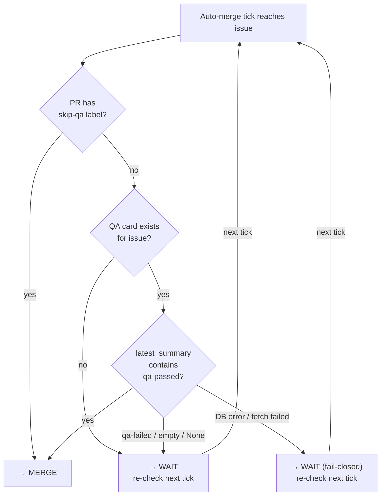
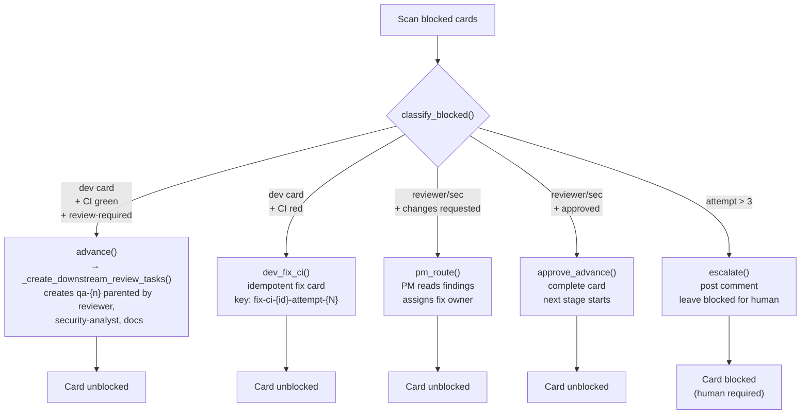
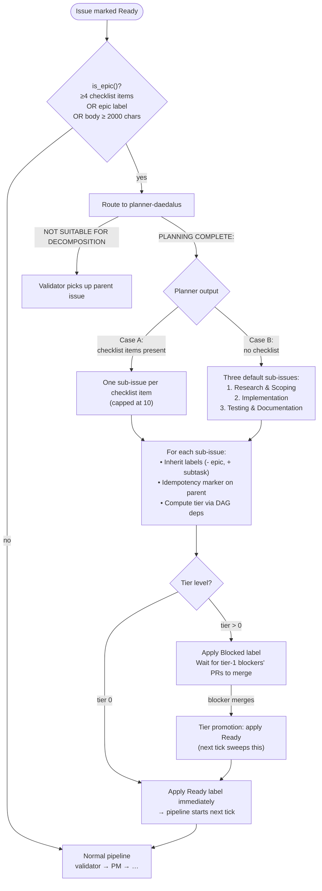

# Documentation Update Plan — Pipeline Reliability & QA Gate

**Task:** t_1d98f240 — synthesize gap analysis (t_d231de66) + technical summary (t_da4858be)
**Consumes:** `docs/gap-analysis.md` + technical summary from t_da4858be
**Date:** 2026-06-29
**Author:** project-manager-daedalus

---

## Executive Summary

The gap analysis identified 12 action items. Reconciling against the current state of
the docs reveals that **5 are already done** (USER_GUIDE §6.5, §6.6, §6.7 exist;
README lines 783-791 document mutex; README lines 39-43 document auto-merge QA
gate). The remaining work is **7 concrete updates** across 4 documents.

This plan is ordered by user-facing impact (HIGH first). Each action has exact file
locations, content outline, and acceptance criteria, so a documentation writer with
no additional context can execute it.

---

## Update 1 — Fix INSTALLATION_GUIDE epic threshold (HIGH)

**File:** `docs/INSTALLATION_GUIDE.md`
**Location:** Line 80 (planner row in "The Nine Agent Roles" table)

### What to Change
The planner row currently reads:

> **planner** | **Handles epic-sized issues** (those with ≥5 subtasks or labeled
> "epic"). Detects the issue type and orchestrates the full decomposition pipeline…

Replace with:

> **planner** | **Handles epic-sized issues** (those with ≥4 markdown checklist
> items (`- [ ]` or `* [ ]`), the `epic` label (case-insensitive), OR issue body
> ≥2000 characters). Detects the issue type and orchestrates the full
> decomposition pipeline…

### Content Outline
1. Replace "≥5 subtasks" with "≥4 markdown checklist items (`- [ ]` or `* [ ]`)".
2. Add the second and third heuristics explicitly: `epic` label (case-insensitive)
   AND body ≥ 2000 characters — both are OR-combined.
3. Mirror the language used in README line 14 and USER_GUIDE §1.1 ("three
   OR-combined heuristics") so users see identical wording across both docs.

### Key Points That Must Be Covered
- Source of truth: `core/providers/base.py:is_epic()`. Mention it for
  traceability, not as a requirement for the reader.
- Clarify that `≥5 subtasks` was never correct — the code has always been `≥4
  checklist items`.

### Acceptance Criteria
- [ ] INSTALLATION_GUIDE line 80 no longer mentions "≥5 subtasks".
- [ ] INSTALLATION_GUIDE line 80 mentions all three heuristics.
- [ ] Wording matches README line 14 and USER_GUIDE §1.1 verbatim (modulo the
      table-cell formatting).

---

## Update 2 — Update README pipeline Mermaid diagram (HIGH)

**File:** `README.md`
**Location:** Lines 10-55 (the main `flowchart TD`)

### What to Change
The diagram shows `QA --> CI{CI}` (line 31) and `CI -->|green| Rev / A11y` (lines
32-33). This structurally depicts CI as the gate for reviewer/a11y — but the
actual behavior is that the **QA agent's `qa-passed` signal** gates the downstream
review roles, as enforced by `_create_downstream_review_tasks()` parenting them to
`qa-{n}`.

Replace lines 30-38 with a sequence that makes the QA signal gate explicit:

```
Dev --> QA["🧪 QA\nTest suite · coverage\nqa-passed / qa-failed"]
QA --> CI{CI}
CI -->|green & qa-passed| Rev["🔍 Reviewer\nCode review\nApprove / request changes"]
CI -->|green & qa-passed| A11y["♿ Accessibility\nWCAG 2.1 AA audit\n(conditional on UI work)"]
CI -->|green & qa-passed| Sec["🛡 Security Analyst\nOWASP audit\nSecrets · injection · authz"]
CI -->|red| Fix["🔧 Fix card created\nidempotent · capped at 3"]
Fix --> Dev
Rev -->|approved| Doc["📝 Documentation\nADRs · changelog\nReport → PR + chat channels"]
Sec -->|cleared| Doc
A11y -->|cleared| Doc
```

### Content Outline
1. Remove the current `Rev -->|approved| Sec -->|cleared| Doc` chain — reviewer
   and security-analyst run in parallel, not sequentially.
2. Add the `qa-passed` gate on each of the three arrows from CI to the review
   roles. The gate label reads `green & qa-passed`.
3. Keep Skip-qa already explicit at the AutoMerge node (lines 39-42) — that
   section is correct.
4. Preserve the existing style declarations (lines 45-54) — only the node IDs
   and edges change.

### Key Points That Must Be Covered
- The diagram must not imply CI gates the review roles alone — the QA signal is
  the primary gate; CI green is the secondary gate.
- reviewer/security-analyst/accessibility must be parallel siblings of the qa
  task, not a chain. The current `Rev → Sec → Doc` is wrong.
- The AutoMerge decision (already present on lines 39-42) remains: `qa-passed`
  signal present OR `skip-qa` label → merge. No change there.

### Acceptance Criteria
- [ ] Mermaid renders without errors in any preview tool (GitHub, Obsidian, VS
      Code markdown preview).
- [ ] CI node has three outgoing edges, each labeled `green & qa-passed`, going
      to Reviewer, Security-Analyst, and Accessibility.
- [ ] Security-Analyst is a parallel sibling of Reviewer, not downstream of it.
- [ ] Accessibility is a parallel sibling of Reviewer, not downstream of it.
- [ ] AutoMerge node still gates on `qa-passed` OR `skip-qa` label (no change
      from current).

---

## Update 3 — Add CHANGELOG entries for missing recent PRs (MEDIUM)

**File:** `CHANGELOG.md`
**Location:** Lines 1-20 (`## [Unreleased]` top block)

### What to Change
The top `## [Unreleased]` block (lines 1-20) already has `Reliability / Race
Condition Fixes`, `QA Gate on Auto-merge`, and `Orphaned Card Safety Nets`
subsections with entries for PRs #1006, #1025, #1026, #1027, #1028, #1029, #1030,
#1031, #1005 — **9 of the 18 "missing" PRs are already there.** The gap analysis
over-stated the deficiency.

The genuinely missing entries are for PRs #954, #952, #950, #941/#943, #937,
#917, #914, #913, #895, and #893. Append them as one-line entries in the
appropriate subsection:

```markdown
### Pipeline Reliability

- QA no longer races developer mid-edit on shared working tree ([#954], closes [#953])
- Validator no longer completes silently with `summary=None` when Claude Code
  delegation fails ([#952], closes [#916])
- `advance hook` registered to postinstall so it ships with the plugin ([#950], closes [#936])
- Dispatcher handler for planner `NOT SUITABLE` signal ([#941], closes [#931])
- Auto-advance sub-issues to Ready after planner decomposition ([#937], closes [#915])
- E2E regression assertions for #891 and #894 ([#917], closes [#902])
- Dry-run mode flag for dispatcher ([#914], closes [#900])
- Multi-tick pipeline harness ([#913], closes [#901])
- Agents no longer silently fail when `GITHUB_TOKEN` not set in cron env ([#895], closes [#894])
- Concurrent dispatcher ticks no longer re-decompose epics ([#893], closes [#891])

[#954]: https://github.com/benmarte/daedalus/pull/954
[#952]: https://github.com/benmarte/daedalus/pull/952
[#950]: https://github.com/benmarte/daedalus/pull/950
[#941]: https://github.com/benmarte/daedalus/pull/941
[#937]: https://github.com/benmarte/daedalus/pull/937
[#917]: https://github.com/benmarte/daedalus/pull/917
[#914]: https://github.com/benmarte/daedalus/pull/914
[#913]: https://github.com/benmarte/daedalus/pull/913
[#895]: https://github.com/benmarte/daedalus/pull/895
[#893]: https://github.com/benmarte/daedalus/pull/893
```

### Content Outline
1. Add one new subsection `### Pipeline Reliability` under `## [Unreleased]`,
   after the `### Orphaned Card Safety Nets` subsection.
2. Ten one-line entries, each formatted `description ([#NNN], closes [#MMM])`.
3. Link reference block at the bottom of the Unreleased section with PR URLs.

### Key Points That Must Be Covered
- Use the actual PR descriptions (t_da4858be metadata has per-change summaries).
- Keep entries to one sentence each — CHANGELOG is a scannable index, not prose.
- Use `closes #issue` linking so GitHub cross-links when the section gets a
   release tag.

### Acceptance Criteria
- [ ] CHANGELOG `[Unreleased]` section lists 10 new entries under the new
      `### Pipeline Reliability` subsection.
- [ ] Each entry has a `[link text]: PR URL` reference at the bottom.
- [ ] No duplicates with entries already present in `## [Unreleased]`
      (specifically: #1006, #1025, #1026, #1027, #1028, #1005, which are
      already linked).

---

## Update 4 — Add QA gate decision Mermaid diagram (MEDIUM)

**File:** `docs/qa-gate-design.md` (or add to README if preferred)
**Location:** New section in `qa-gate-design.md`

### What to Change
`docs/qa-gate-design.md` exists but has no diagram. Add a Mermaid decision tree
after the text explaining `_qa_passed_for_issue()`:



### Content Outline
1. Three terminal outcomes: `→ MERGE`, `→ WAIT (re-check next tick)`,
   `→ WAIT (fail-closed)`.
2. Start from the auto-merge tick.
3. `skip-qa` label short-circuits — checked first.
4. No QA card → wait (the QA agent hasn't run yet).
5. QA card exists, inspect `latest_summary`:
   - Contains `qa-passed` (case-insensitive, .strip() tolerant) → merge.
   - Contains `qa-failed` or empty → wait.
   - DB error / fetch failed → wait (fail-closed — never silently merge).

### Key Points That Must Be Covered
- Source of truth: `core/iterate.py:_qa_passed_for_issue()`.
- Fail-closed is the explicit default: never merge on uncertainty.
- `qa-passed` signal is emitted by the QA agent into its own `latest_summary`
  field; the gate reads the field, no cross-card lookup is performed.

### Acceptance Criteria
- [ ] Diagram is a `flowchart TD` that renders cleanly.
- [ ] Diagram is reachable from the `qa-gate-design.md` Table of Contents.
- [ ] Diagram matches the behavior described in `core/iterate.py:_qa_passed_for_issue()`.

---

## Update 5 — Add self-healing loop Mermaid diagram (MEDIUM)

**File:** `README.md`
**Location:** New subsection after line 841 (end of the existing
`````blocked card detected``/````` block)

### What to Change
The current self-healing loop is described as a pseudo-code tree (lines 806-841).
Add a Mermaid flowchart that renders visually:



### Content Outline
1. Root: `Scan blocked cards` → `classify_blocked()`.
2. Five branches matching the five actions in `core/iterate.py`.
3. Each branch resolves to either "Card unblocked" or "Card blocked (human
   required)" for the escalation path.

### Key Points That Must Be Covered
- The diagram reflects `_create_downstream_review_tasks()` parenting reviewer,
   security-analyst, docs to `qa-{n}` — not to the dev card (this was the PR
   #985 fix).
- The escalation cap matches `MAX_FIX_ATTEMPTS = 3`.
- The diagram is the visual companion to the pseudo-code tree — they must remain
   in sync.

### Acceptance Criteria
- [ ] Diagram renders in GitHub markdown preview without errors.
- [ ] Five classify branches are present and correctly labeled.
- [ ] Diagram placed immediately after the existing pseudo-code block (lines
      806-841) so they read together.

---

## Update 6 — Add epic decomposition + tier promotion diagram (MEDIUM)

**File:** `README.md`
**Location:** New subsection after the Phase 3 text section (currently around line
182-281; find the `## Customizing agents` boundary and insert before it OR
immediately after the existing Phase 3 prose)

### What to Change
Add a Mermaid flowchart for the epic decomposition + tier promotion pipeline:



### Content Outline
1. Epic detection uses the three OR-combined heuristics (matching §1.1).
2. Planner either emits `PLANNING COMPLETE` (decomposition proceeds) or
   `NOT SUITABLE FOR DECOMPOSITION` (parent is sent to validator as fallback).
3. Two decomposition strategies (Case A: checklist, Case B: three fixed
   sub-issues).
4. Tier computation produces tier 0 (Ready now) or tier > 0 (wait for blocker).
5. Promotion is non-destructive — Ready label applied by the tier-promotion
   sweep on the next tick.

### Key Points That Must Be Covered
- Reference `core/tier_promotion.py` for tier computation logic.
- Reference `core/iterate.py:_execute_planner_decompose()` for decomposition.
- Reference the `<!-- daedalus:sub-issues:[…] -->` idempotency marker to explain
   why a re-dispatch won't re-create sub-issues.

### Acceptance Criteria
- [ ] Diagram renders in GitHub markdown preview without errors.
- [ ] Diagram correctly depicts the NOT SUITABLE fallback path.
- [ ] Diagram shows both Case A and Case B decomposition strategies.
- [ ] Diagram shows tier 0 (Ready immediately) vs tier > 0 (wait for blocker).
- [ ] Placed adjacent to the Phase 3 prose it illustrates.

---

## Update 7 — Link design docs from README "Development references" (LOW)

**File:** `README.md`
**Location:** Lines 1300-1305 (the "Development references" table)

### What to Change
Three existing docs are not currently linked from this table:

```markdown
| Document | Purpose |
|----------|---------|
| [`SPEC.md`](SPEC.md) | … (existing) |
| [`design-retry-cap-notification.md`](design-retry-cap-notification.md) | … (existing) |
| [`CONTRIBUTING.md`](CONTRIBUTING.md) | … (existing) |
| [`CHANGELOG.md`](CHANGELOG.md) | … (existing) |
| [`docs/qa-gate-design.md`](docs/qa-gate-design.md) | Design spec for the QA auto-merge gate: signal format, fail-closed semantics, `skip-qa` bypass, `_qa_passed_for_issue()` implementation. |
| [`docs/e2e-smoke-test.md`](docs/e2e-smoke-test.md) | How to run the end-to-end smoke test — what it asserts, what it does not access, and how to extend it. |
| [`docs/ci-plugin-lifecycle.md`](docs/ci-plugin-lifecycle.md) | CI plugin lifecycle: when hooks fire, how the pipeline integrates with GitHub Actions / GitLab CI / Azure Pipelines. |
```

### Acceptance Criteria
- [ ] Three new rows in the Development references table.
- [ ] Each link is a relative path (starts with `docs/`).
- [ ] Each description is one sentence, matching the format of existing entries.

---

## Out of Scope (Already Addressed)

These gap-analysis items are already done and require no further action:

| Item | Why Already Done |
|------|------------------|
| QA gate section in USER_GUIDE | Lines 884-915 (`### 6.5 QA Gate for Auto-Merge`) |
| FileLock mutex docs in USER_GUIDE | Lines 917-941 (`### 6.6 Dispatcher Concurrency`) |
| Status-blind guards in USER_GUIDE | Lines 943-967 (`### 6.7 Status-Blind Re-Triage`) |
| FileLock mutex paragraph in README | Lines 783-791 |
| `skip-qa` label in README | Line 41 (`yes OR skip-qa label`) in main Mermaid diagram |
| Approve-signals cleanup | Lines 853-859 (self-healing section) |
| Downstream role ordering (dev→qa→reviewers) | Lines 812-818 (self-healing section) |
| Monotonic idempotency keys | CHANGELOG line 7 |

---

## Execution Order (Suggested)

1. **Update 1** (INSTALLATION_GUIDE) — 2 minutes, no dependencies.
2. **Update 3** (CHANGELOG) — 15 minutes, no dependencies.
3. **Update 7** (README dev references) — 5 minutes, no dependencies.
4. **Update 2** (README main Mermaid) — 15 minutes, no dependencies.
5. **Update 4** (QA gate Mermaid) — 10 minutes, no dependencies.
6. **Update 5** (Self-healing Mermaid) — 20 minutes, no dependencies.
7. **Update 6** (Epic decomposition Mermaid) — 20 minutes, no dependencies.

Total estimated effort: ~85 minutes for a documentation writer.

All updates are independent of each other; they can be done in any order or
in parallel. Updates 4/5/6 are Mermaid diagrams and benefit from being
proofread in a Mermaid live-editor before being pasted in.

---

## Cross-Document Consistency Checks (After Completion)

After executing all 7 updates, a documentation writer should verify:

1. Epic detection is described identically in:
   - README line 14
   - USER_GUIDE §1.1 line 62
   - INSTALLATION_GUIDE line 80
2. The main pipeline Mermaid (README lines 10-55) and the self-healing Mermaid
   (new addition after line 841) agree on `_create_downstream_review_tasks()`
   parenting (all three → `qa-{n}`, not → dev).
3. CHANGELOG Unreleased section does not duplicate PR references already
   present.
4. All Mermaid diagrams render in GitHub markdown preview (paste into
   https://mermaid.live to double-check before committing).
5. All relative links work from the repo root (spot-check the 3 new
   README entries).

---

## Deliverable

This document (`docs/documentation-update-plan.md`) is the deliverable for task
t_1d98f240. It specifies every file, line, and content change required to bring
the docs up to date with the pipeline reliability and QA gate changes through
PR #1031.
